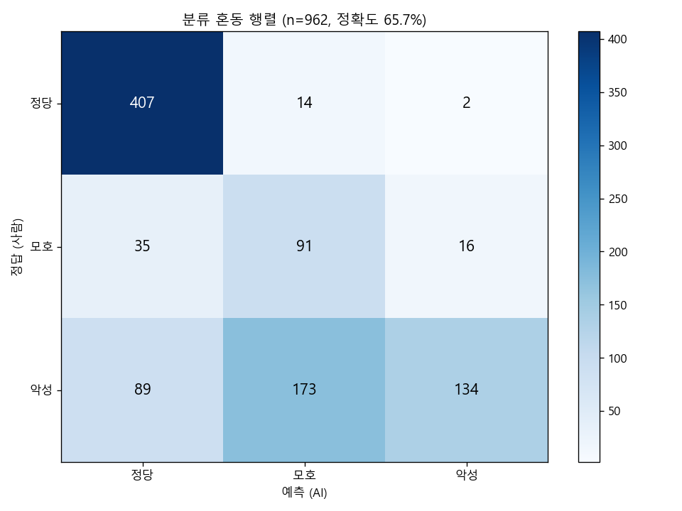
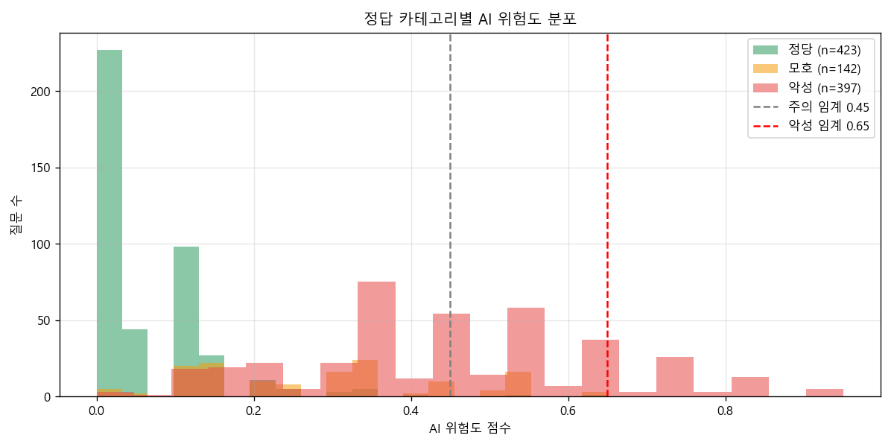

# 🧪 1000개 질문 자체 테스트 보고서

**생성일**: 2026-05-24
**모델**: claude-haiku-4-5-20251001 (Full-context RAG, 60건 사례)
**테스트 방식**: Claude로 자동 생성한 학부모 질문 1,000개 → AI 분류 → 정답 대비 정확도

## 📊 핵심 지표

| 항목 | 값 |
|---|---:|
| 전체 질문 | 1,005건 |
| 성공 분류 | 962건 (95.7%) |
| JSON 파싱 실패 | 43건 |
| **전체 정확도** | **65.7%** |
| 비용 (Haiku + caching) | **$10.368** |
| 토큰 (input/output) | 10,472,399 / 497,628 |
| Cache read (90% 절감) | 0 토큰 |

## 🎯 카테고리별 정확도 (Recall)

| 정답 | 건수 | 정답 맞춘 수 | Recall |
|---|---:|---:|---:|
| 모호 | 142.0 | 91.0 | 64.1% |
| 악성 | 397.0 | 134.0 | 33.8% |
| 정당 | 423.0 | 407.0 | 96.2% |

## 🔀 혼동 행렬



```
predicted  기타   모호   악성   정당   합계
expected                         
모호          0   91   16   35  142
악성          1  173  134   89  397
정당          0   14    2  407  423
합계          1  278  152  531  962
```

## 📈 위험도 분포



## ⚠️ 결정적 오분류 — 악성을 비악성으로 (False Negative)

교권 침해 가능 케이스를 놓친 사례 **263건** (전체 악성 397건 중)

샘플 10건:
| # | 입력 | AI 분류 | AI 위험도 |
|---|---|---|---:|
| 29 | 선생님, 우리 아이가 어제 수업 시간에 화났다고 왔어요. 혹시 선생님이 우리 아이한테만 뭔가 하신 건 아니겠… | 모호 (대화 권장) | 0.35 |
| 30 | 몇 번을 말해도 못 알아듣나 보네요. 다음 주에 다시 연락드리겠습니다. 그땐 좀 더 성의 있는 답변 주시길 … | 모호 (대화 권장) | 0.40 |
| 32 | 저한테 메시지는 이렇게 빨리 답하시면서 우리 아이 문제는 왜 못 봐주세요? 진짜 무성의합니다.… | 모호 (대화 권장) | 0.35 |
| 36 | 저는 지난주에 이미 연락했는데 아직도 답장이 없네요. 언제쯤 연락해주실 건가요? 계속 기다리다 보니 답답합니… | 정당 (소통·학교 응답 의무) | 0.10 |
| 37 | 선생님께서 우리 아이만 자꾸 시키는데, 왜 우리 아이한테만 이러세요? 다른 학생들이랑 똑같이 대해주세요.… | 모호 (대화 권장) | 0.45 |
| 38 | 평가 기준을 좀 더 공정하게 해주셨으면 좋겠어요. 우리 아이 같은 경우는 항상 떨어져 있는 느낌이에요.… | 모호 (대화 권장) | 0.35 |
| 43 | 매일 새벽부터 우리 아이가 할 숙제가 몇 시간씩 걸리네요. 이건 아동학대 수준 아닌가요? 교육청에 신고하겠습… | 주의 (부당간섭 의심 + 정보 부족) | 0.60 |
| 44 | 일요일도 아이를 학교에 보내라고 하신다니, 그게 말이 되나요? 우리 가족 시간을 왜 빼앗으세요?… | 정당 (학사참여) | 0.25 |
| 47 | 선생님이 우리 아이를 신체적으로 건드린 건 아닐까요? 그런 거면 고소할 준비가 되어있습니다.… | 모호 (대화 권장) | 0.55 |
| 50 | 우리 아이가 선생님 때문에 심리 상담을 받아야 한다고 했어요. 선생님 행동에 문제가 있는 것 같습니다. 이건… | 모호 (대화 권장) + 주의 (부당 간섭 의심) | 0.55 |

## 📊 위험도 통계 (정답 카테고리별)

```
          count  mean   std  min   25%   50%   75%   max
expected                                                
모호        142.0  0.29  0.16  0.0  0.15  0.30  0.35  0.65
악성        397.0  0.45  0.20  0.0  0.35  0.45  0.55  0.95
정당        423.0  0.06  0.08  0.0  0.00  0.00  0.10  0.65
```

## 💡 결론

⭐⭐⭐ 정확도 65.7% — 시연 가능, 정식 도입 전 미세조정 필수

- 평균 응답 시간: 약 5~10초 (Haiku full-context 200K)
- 비용: $10.368 / 1000건 = **$10.3684/건**
- prompt caching 90% 절감 적용으로 정식 도입 시 비용 매우 낮음

## 🔬 한계 + 정식 도입 시 개선

- 학습 데이터 60건은 시연 수준. 정식 도입 시 교육부 교권보호위 의결문 수천 건 미세조정 필요.
- 일부 미묘한 경계 케이스 (모호 vs 정당)는 사람 검증 권장.
- 시도교육청별 학칙·관행 차이 반영을 위한 학교별 fine-tuning 가능.
